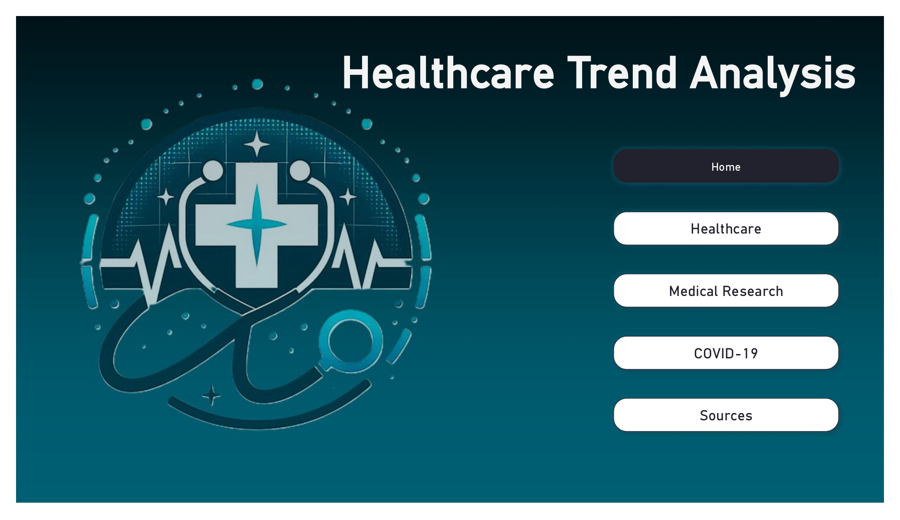
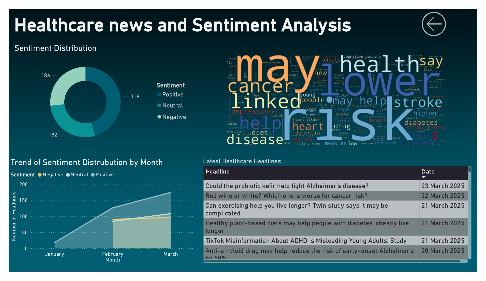
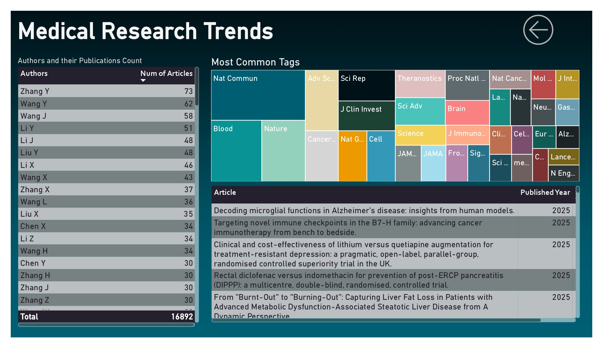
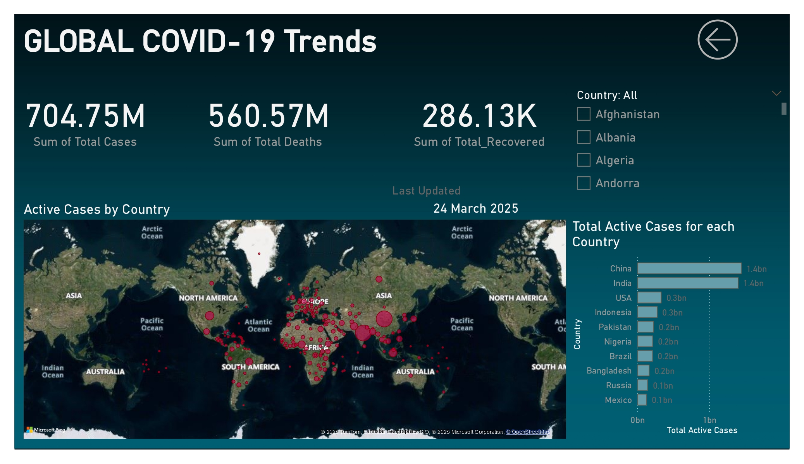
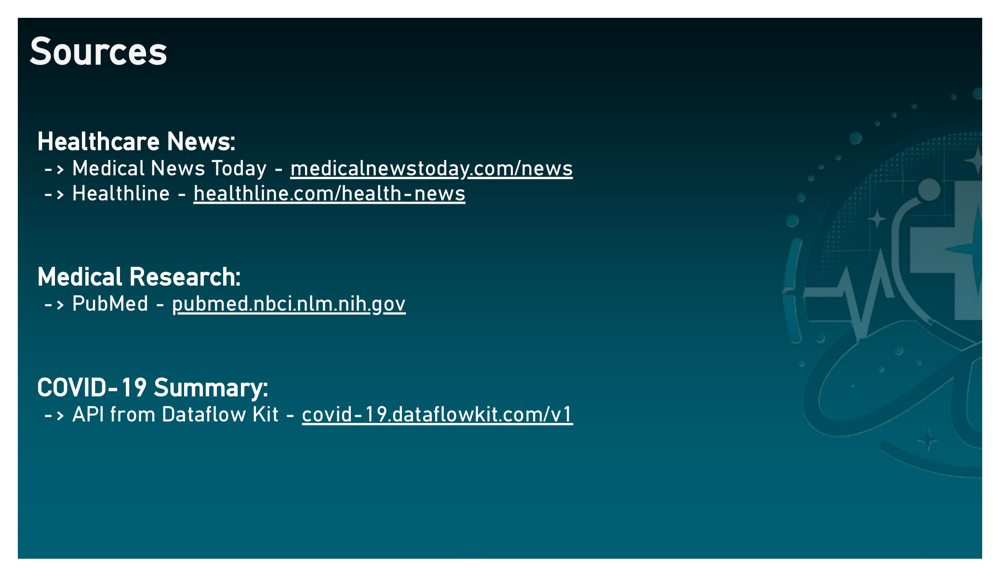

# Healthcare Trend Analysis


## Introduction
This project involves scraping, processing, and visualizing healthcare data using Power BI to analyze trends in medical research, news, and global health statistics. The dashboard includes sentiment analysis of healthcare news, real-time medical headlines, common research topics across journals, publication analysis of top researchers, medical research trends, and global COVID-19 statistics such as cases, deaths, and recoveries, providing insights into public sentiment, emerging medical advancements, and global healthcare trends.

## Project Type
**Data Analysis | Web Scraping | Data Visualization**

## Deployed App
**Dashboard:** 

## Directory Structure
B43_DA_074_Recommendation-System-Engineers/  
├── data/                
│   ├── covid_sum.csv   
│   ├── medical_news.csv       
│   └── pubmed.csv     
├── images/ *   
├── notebook/   
│   └── webscraping.ipynb   
├── schema/   
│   └── healthcare_dump.sql 
├── scripts/                
│   ├── covid_overall.py     
│   ├── news_scraper.py  
│   ├── pubmed_scrape.py  
│   └── sql_connect.py    
├── Dashboard.pbix  
├── requirements.txt  
└── README.md     

## Video Presentation of the Project

## Features
**Web Scraping:** Scrape medical research articles, news, and COVID-19 data from platforms like PubMed, MedicalNewsToday, and Medscape.

**Data Cleaning:** Clean and preprocess scraped data to remove duplicates, irrelevant content, and formatting issues.

**Trend Analysis:** Analyze trends in medical treatments, disease outbreaks, and healthcare technologies using SQL and Python.

**Data Visualization:** Create interactive dashboards in Power BI to visualize trends and insights.

**Sentiment Analysis:** Perform sentiment analysis on healthcare news articles to gauge public sentiment.

**Keyword Extraction:** Extract and analyze top keywords from medical research articles.

## Installation & Getting Started
Prerequisites  
Python 3.8+

Power BI (for visualization)

SQL Database (MySQL)

## Installation
### Clone the repository:
```bash
git clone https://github.com/RaviVarma28/B43_DA_074_Recommendation-System-Engineers
```
```bash
cd B43_DA_074_Recommendation-System-Engineers
```
### Install Python dependencies:

```bash
pip install -r requirements.txt
```

### Set up the SQL database:

- Import the provided SQL schema into your database.

- Update the database connection details in scripts/analyze_data.py.

### Run the scraping scripts:

```bash
python scripts/news_scraper.py
python scripts/pubmed_scrape.py
python scripts/covid_overall.py
```
**Note:** Change the username and password for MySQL Database in sq

### Update the database:
```bash
python scripts/sql_connect.py
```
This will automatically update the database, if the previous scripts are run beforehand to make sure the data procurred is up-to-date.

**Note:** Change the username and password for MySQL Database in sql_connect.py before running the file.

## APIs Used
**COVID-19 API:** DataflowKit COVID-19 API

### API Endpoints


**GET /v1**: List ALL COVID-19 cases per country.

## Technology Stack
**Web Scraping:** Selectolax, HTTPX

**Data Cleaning:** pandas, spaCy, nltk

**Analysis:** SQL, pandas, numpy, scikit-learn

**Visualization:** Power BI, Matplotlib, Seaborn

**Database:** MySQL

**Programming Language:** Python

## Screenshots






## Contact
**Author:** Ravi Kiran Venkata Sai Varma Gedela  
[**Github**](https://github.com/RaviVarma28)    
[**Linkedin**](https://www.linkedin.com/in/ravivarma2899) 